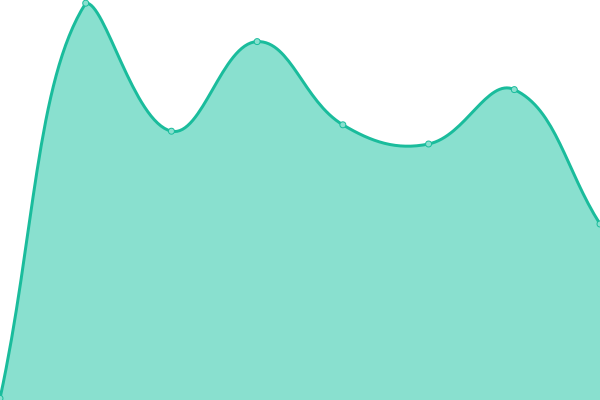

# [📈 Live Status](https://status.animmouse.com): <!--live status--> **🟩 All systems operational**

This repository contains the open-source uptime monitor and status page for [Anim Mouse](https://www.animmouse.com/), powered by [Upptime](https://github.com/upptime/upptime).

With [Upptime](https://upptime.js.org), you can get your own unlimited and free uptime monitor and status page, powered entirely by a GitHub repository. We use [Issues](https://github.com/AnimMouse/animmouse-upptime/issues) as incident reports, [Actions](https://github.com/AnimMouse/animmouse-upptime/actions) as uptime monitors, and [Pages](https://status.animmouse.com) for the status page.

<!--start: status pages-->
<!-- This summary is generated by Upptime (https://github.com/upptime/upptime) -->
<!-- Do not edit this manually, your changes will be overwritten -->
<!-- prettier-ignore -->
| URL | Status | History | Response Time | Uptime |
| --- | ------ | ------- | ------------- | ------ |
|  [AnimMouse Main](https://www.animmouse.com) | 🟩 Up | [anim-mouse-main.yml](https://github.com/AnimMouse/animmouse-upptime/commits/master/history/anim-mouse-main.yml) | 

 120ms
     
 | 

<a href="https://status.animmouse.com/history/anim-mouse-main">100.00%</a>
    

|  [AnimMouse Paraphrase](https://paraphrase.animmouse.com) | 🟩 Up | [anim-mouse-paraphrase.yml](https://github.com/AnimMouse/animmouse-upptime/commits/master/history/anim-mouse-paraphrase.yml) | 

 225ms
     
 | 

<a href="https://status.animmouse.com/history/anim-mouse-paraphrase">100.00%</a>
    

|  [Atrack](https://atrack.eu.org) | 🟩 Up | [atrack.yml](https://github.com/AnimMouse/animmouse-upptime/commits/master/history/atrack.yml) | 

 279ms
     
 | 

<a href="https://status.animmouse.com/history/atrack">100.00%</a>
    

|  [1 14 9 13](https://www.114913.xyz) | 🟩 Up | [1-14-9-13.yml](https://github.com/AnimMouse/animmouse-upptime/commits/master/history/1-14-9-13.yml) | 

 155ms
     
 | 

<a href="https://status.animmouse.com/history/1-14-9-13">100.00%</a>
    

|  [1 14 9 13 redirects](https://r.114913.xyz) | 🟩 Up | [1-14-9-13-redirects.yml](https://github.com/AnimMouse/animmouse-upptime/commits/master/history/1-14-9-13-redirects.yml) | 

 143ms
     
 | 

<a href="https://status.animmouse.com/history/1-14-9-13-redirects">100.00%</a>
    

<!--end: status pages-->

[**Visit our status website →**](https://status.animmouse.com)

## 📄 License

- Powered by: [Upptime](https://github.com/upptime/upptime)
- Code: [MIT](./LICENSE) © [Anim Mouse](https://www.animmouse.com/)
- Data in the `./history` directory: [Open Database License](https://opendatacommons.org/licenses/odbl/1-0/)
